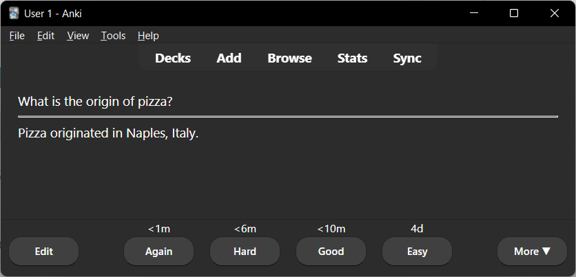

# ankigpt
Automatically generate com1prehensive Anki flashcard decks on any topic using the power of chatGPT. Turn a simple topic into a rich learning experience with AI-driven content.

### Prerequisites:
- Install the `genanki` and `openai` Python packages. You can do this using pip:
```bash
pip install genanki openai
```

### Usage:

1. Save the provided code in a Python script, for example, `anki_generator.py`.
2. Run the script:
```bash
python anki_generator.py
```
3. You will be prompted to enter the topic for your Anki deck, e.g.:
```
Enter the topic of your Anki deck: Pizza
```
4. Next, define the number of cards you'd like:
```
Enter the number of cards you want to add: 10
```
5. Provide your OpenAI API key:
```
Enter your OpenAI API key: YOUR_API_KEY_HERE
```

### ChatGPT output:

1. "What is pizza?": "Pizza is a popular dish of Italian origin, consisting of a usually round, flattened base of leavened wheat-based dough topped with tomatoes, cheese, and often various other ingredients which is then baked at a high temperature.",
2. "Where did pizza originate from?": "Pizza originated from Italy, more specifically from Naples, a city in southern Italy, in the 18th century.",
3. "What are the basic ingredients needed to make pizza?": "The basic ingredients needed to make pizza are pizza dough, pizza sauce (usually made from tomatoes), cheese, and toppings such as vegetables, meats, and herbs.",
4. "What different types of pizza are there?": "There are many types of pizza, including but not limited to, Neapolitan Pizza, New York-Style Pizza, Chicago Pizza, Sicilian Pizza, Greek Pizza, California Pizza, Detroit Pizza, and St. Louis Pizza.",
5. "How is pizza typically cooked?": "Pizza is typically cooked in a high-temperature oven. Traditional Italian pizza is often cooked in a wood-fired oven to give it a unique flavor.",
6. "Who invented pizza?": "The modern pizza that we're familiar with was first made by baker Raffaele Esposito in Naples. However, the concept of using bread as a dish underneath toppings has been used for millennia.",
7. "What is the most popular pizza topping?": "The most popular pizza topping is generally considered to be pepperoni, followed closely by mushrooms, onions, sausage, and bacon.",
8. "How is traditional Neapolitan pizza made?": "Traditional Neapolitan pizza is made with simple, fresh ingredients: a basic dough, raw tomatoes, fresh mozzarella cheese, fresh basil, and olive oil. It's then cooked in a wood-fired oven for just a few minutes.",
9. "What are some popular pizza chains?": "Some popular pizza chains are Domino's, Pizza Hut, Papa John's, Little Caesars, and Papa Murphy's.",
10. "Is pizza healthy?": "Pizza can be healthy if made with whole-grain crust, tomato sauce, lean meats, and lots of vegetables. However, many commercial pizzas are made with refined grains, saturated fats, and high amounts of sodium, which can contribute to obesity and other health issues if consumed in excess."

### Script output:

After entering the required details, the script will process the information and produce a message:
```
Your Anki deck has been generated!
```

You will find an Anki deck file named `pizza_deck.apkg` (or whatever topic you chose) in the current directory. You can import this deck into Anki and start studying.


